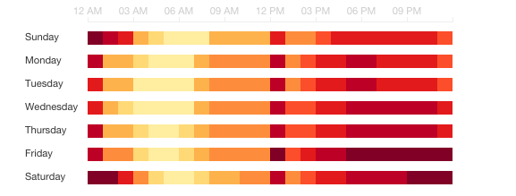

# D3 Day of Week by Hour of Day Chart

A "heatmap" for patterns in day of week (Su-Sa) and Hour of day (0-24).

## Example Screenshot


## Usage
Creating a chart is easy :)
```js
var data = [{"date": new Date(2015,4,4,1), "count": 10 }];
var chart = dayOfWeekChart();
d3.select('body').data(data).call(chart);
```

## Configuration
The chart is configurable. It follows Mike Bostocks "rules" for creating reusable charts.
If you want to change the height of the chart just use the following:
```js
var chart = dayOfWeekChart().height(400)
```

### Configurable Elements:
element | explanation|type|default
----|----|----|----
height|height of each day|int|20
width|width of the chart|int|700
cellSize|the size of each element(cell)|int|20
xTicks|number of hour ticks|int|3
weekDays|array of weekdays|array|['Sunday', 'Monday', 'Tuesday', 'Wednesday', 'Thursday', 'Friday', 'Saturday']
startDate|the date/weekday of the start|Date|2015-04-03
valueKey|the key used for calculating the heatmap|string|"count"

#### Configuration Functions
If you want to use different formatted data you can use these functions to change the default behaviour

__xValue__
Change the way date entries are selected
Default function:
```js
function xValue (date) {
  var dowHFormat = d3.time.format("%w %H");
  var entry = _.find(this, (d) -> dowHFormat(d.date) == dowHFormat(date));
  if(entry) {
    return entry[valueKey]
  }
}
```
to change just assign a new function to xValue
```js
newXValue = function xValue (date) {
  return data[date];
}
var chart = dayOfWeekChart().xValue(newXValue)
```
